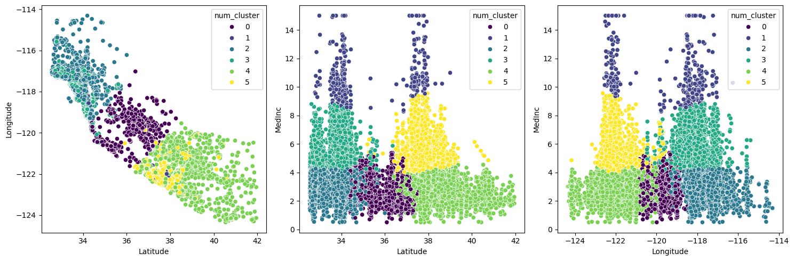

# K-Means Unsupervised Learning

This repository contains an implementation of the K-Means unsupervised learning algorithm applied to the California Housing dataset. The goal is to explore the inherent patterns and clusters within the data to gain insights into the housing market in California.

## Content

- [Usage](#usage)
- [Examples](#examples)
- [Project Structure](#project-structure)
- [Contribution](#contribution)

## Usage

Enter in `src` and explore the jupyter notebooks

## Examples

Clusters created from the k-means model

## Project Structure

- `models/`: Stores the trained model (if applicable).
- `data/`: Directory to store the training and testing datasets.
- `src/`: Contains the source code for the project.
- `docs/`: Documentation files for the project.
- `README.md`: Project documentation.

## Contribution

Contributions are welcome! If you find any issues or have improvements, please open an issue or submit a pull request.

